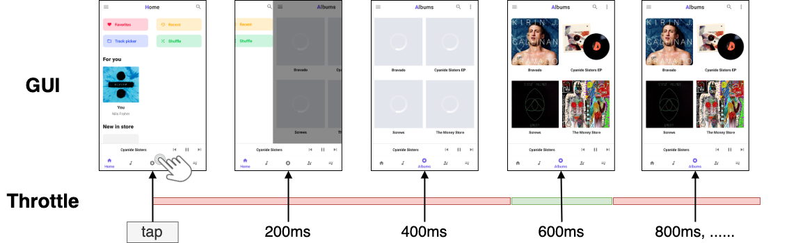
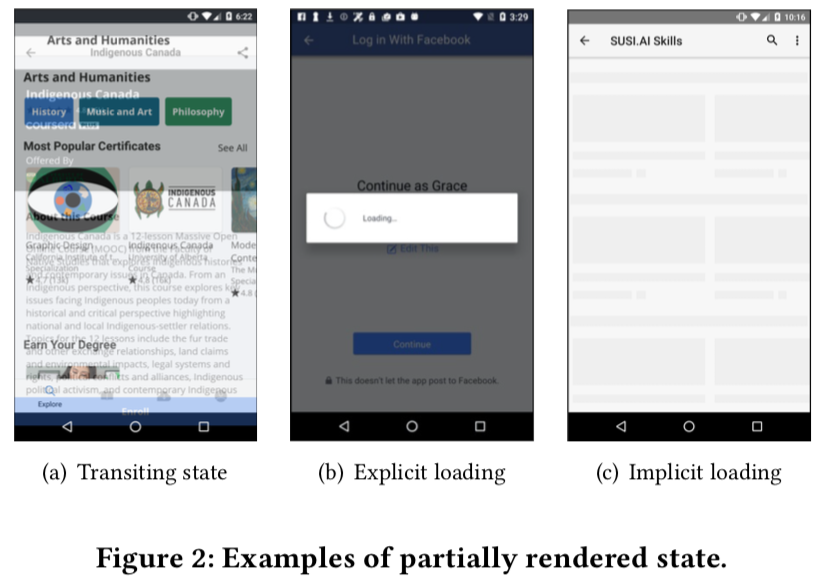
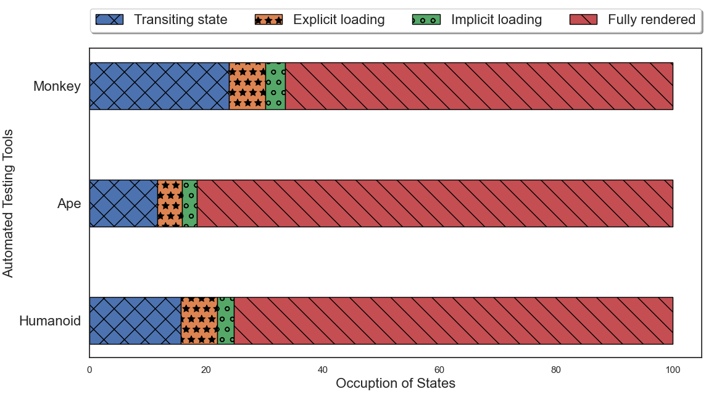
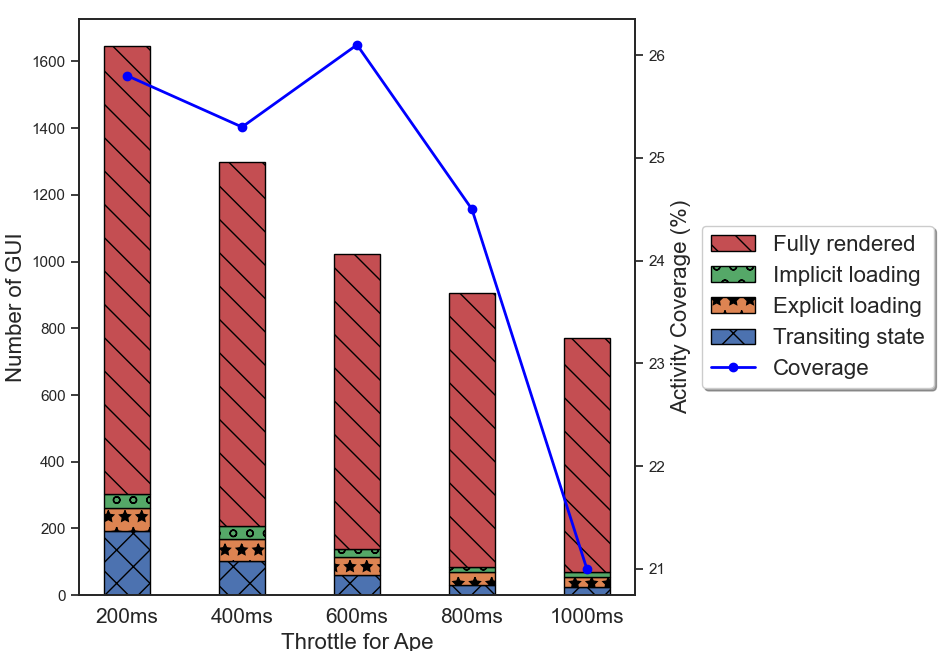
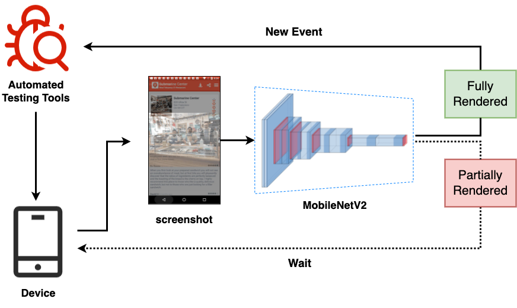
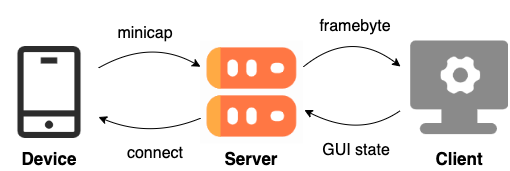

# Speeding Up Automated Testing with GUI Rendering Inference

## Table of Contents
- [Table of Contents](#table-of-contents)
- [Getting Started](#getting-started)
- [Motiviational Study](#motiviational-study)
    - [Categorizing GUI rendering state](#categorizing-gui-rendering-state)
    - [Are partially rendered states common in testing tools?](#are-partially-rendered-states-common-in-testing-tools)
    - [How to address partially rendered states?](#how-to-address-partially-rendered-states)
    - [Why makes throttle adaptive?](#why-makes-throttle-adaptive)
- [Approach](#approach)
    - [Data Preparation](#data-preparation)
    - [GUI Rendering State Classification](#gui-rendering-state-classification)
    - [Model Deployment](#model-deployment)
- [Evaluation](#evaluation)
    - [RQ1: Performance of Model](#rq1-performance-of-model)
    - [RQ2: Performance of Throttledroid](#rq2-performance-of-throttledroid)
    - [RQ3: Usefulness of Throttledroid](#rq3-usefulness-of-throttledroid)

## Getting Started

 

Figure: Automated GUI testing with different throttle.

Due to the importance of Android app quality assurance, many automated testing tools have been developed.
Although the test algorithms have been improved, they still face the issue of striking a balance between effectiveness and efficiency.
On the one hand, if sending the testing events too fast (e.g., Figure 200ms 400ms), the events may execute on partially rendered states, which are prone to app crashes, causing redundant test sequences and restricting deep app functionalities discovery.
On the other hand, if sending the testing events too slow (e.g., Figure 800ms), the testing may stagnate on GUI for a long time, reducing the efficiency of testing.

While the app under testing is mostly idle, the tool has to wait until the GUI finishes rendering before moving to the next event.
To that end, we propose Throttledroid, a lightweight image-based approach to dynamically adjust the inter-event time based on GUI rendering inference.
Given the real-time streaming on the GUI, Throttledroid adopts a deep learning model to infer the rendering state, and synchronizes with the testing tool to schedule the next event until the GUI is fully rendered.

## Motiviational Study
To better understand the issues of automated testing tools with throttling, we carried out a pilot study to examine the prevalence of these issues, so as to facilitate the development of our tool to enhance the existing Android testing tools.

> For more details and experimental setup, please check the instructions in [README.md](./motiviational_study/README.md)

### Categorizing GUI rendering state

 

* **Fully Rendered State.** A fully rendered state represents a complete transition to the GUI with all resources loaded.

* **Transiting State.** One state is transiting to the next state.
As the transition between states takes longer than the throttle, two GUIs are overlapped with each other.

* **Explicit Loading State.** Depicts a loading bar in the GUI, such as spinning wheel, linear progressing bar, etc.
It explicitly indicates the process or rendering is in progress.

* **Implicit Loading State.** Some resources are not showing due to network latency or resource defects.

By conducting a pilot study on Monkey, we categorize four types of GUI rendering states that lie into fully rendered states, and partially rendered states (e.g., transiting state, explicit loading state, and implicit loading state)

### Are partially rendered states common in testing tools?

 

Figure: Distribution of rendering states captured by Monkey, Ape, and Humanoid.

By analyzing three commonly-used testing tools, we find that they all encounter the issue with partially rendered states, which may negatively influence the effectiveness when testing.

### How to address partially rendered states?

 

Figure: Number of GUIs and activity coverage in different throttle settings of Ape.

By analyzing five different throttle intervals, we find that extending throttle can help address the issue with partially rendered states.
However, an excessive long throttle can reduce the efficiency of automated exploration.

### Why makes throttle adaptive?
These findings confirm the importance of throttle setting to automated testing, and motivate us to design an approach for balancing effectiveness and efficiency. Taken in this sense, it is worthwhile developing a new effective and efficient method to dynamically adjust the throttle during testing.

## Approach

 

Figure: The overview of Throttledroid.

This paper proposes a simple but effective approach Throttledroid to adaptively adjust the throttle base on GUI screenshots.
Given that automated testing tools test on the device, we synchronously stream the GUI screenshot capturing, and detect its current rendering state.
Based on the GUI rendering inference, we schedule the testing events, which will be sent if the GUI is fully rendered, otherwise, wait explicitly for rendering.

> For more approach details and experimental settings, please check the instructions in [README.md](./approach/README.md)

### Data Preparation

 

Figure: Pipeline for automated data collection.

The foundation of understanding GUI rendering state and training deep learning model is big data, whereas manual labeling is prohibitively expensive.
We leverage image processing techniques to extract frames from GUI transiting screencasts to automated construct a large-scale binary GUI dataset, including 66,233 fully rendered and 45,623 partially rendered GUIs. 

### GUI Rendering State Classification
We adopt an implementation of MobileNetV2, which distills the best practices in convolutional network design into a simple architecture to identify whether the GUI is fully rendered which allows testing tools to execute the next event; or whether the GUI is partially rendered which waits until the rendering is complete.

### Model Deployment

 

Figure: Overview of model deployment.

To make the model efficiently provide feedback of GUI rendering state to the automated testing tool, synchronization of the GUI and the testing tool is needed.
Therefore, we develop a socket-based smartphone test farm using OpenSTF to stream the real time GUI screenshot.

Once the screenshot buffer is received, we decode it into a PyTorch tensor.
This tensor is then fed into our trained GUI state classification model to infer the rendering state of current GUI.
If it is fully rendered, we continue to test on the new event, otherwise, we explicitly wait for the next screenshot buffer.

## Evaluation
The main quality of our study is the extent to whether our Throttledroid can effectively and efficiently accelerate the automated testing process.
To achieve our study goals, we formulate the following three research questions:

- **RQ1:** How accurate is our model in classifying GUI rendering state?
- **RQ2:** How effective and efficient is our approach in finding bugs?
- **RQ3:** How useful is our approach when integrated in real-world automated testing tools?

For RQ1, we first present some general performance of our model for GUI rendering inference and the comparison with state-of-the-art baselines.
As the ultimate goal of automated testing is to find bugs, we then evaluate the efficiency of our approach for bug detection in RQ2.
However, the randomness of the automated testing may affect the efficiency measurement, that is exploring different objects across different runs.
To ensure the validity of evaluation, we set up a bug seed, which would generate the same sequence of events across different runs to trigger bugs.
For RQ3, we integrate Throttledroid with DroidBot as an enhanced automated testing tool to measure the ability of our approach in real-world testing environments.

> For more details and experimental setup, please check the instructions in [README.md](./evaluation/README.md)

### RQ1: Performance of Model

 

Our model achieves 99.8% accuracy which is much higher than that of baselines, e.g., 31.8% boost compared with the best machine learning baseline (SIFT-SVM). In addition, our model takes on average 43.02ms per GUI inference, representing the ability of our model to accurately and efficiently discriminate the GUI rendering state.

### RQ2: Performance of Throttledroid

 

Our approach can detect most of the bugs (89%) in less time (15.16 seconds), e.g., 23% more bugs at similar run-time as 400ms setting, while 27% more efficient than 1000ms setting with the same bug detection rate. In addition, leveraging a real-time GUI rendering monitor speeds up the testing process than that of an asynchronous monitor (Ours Async), saving 1.52 seconds for 10.6 steps on average.
As a result, much of the time budget will be saved in hundreds or thousands of steps for long-term testing.

### RQ3: Usefulness of Throttledroid

 

Droidbot+Ours achieves a median activity coverage of 43.14% across 32 Android apps, which is 6.95% higher even compared with the best baseline (e.g., 36.19% in Throttle 200ms). In addition, Droidbot+Ours explores 3,207 GUI states, and 88.81% are fully rendered, indicating the effectiveness and efficiency of our approach in covering most of the activities and fully rendered GUIs in real-world testing environments.