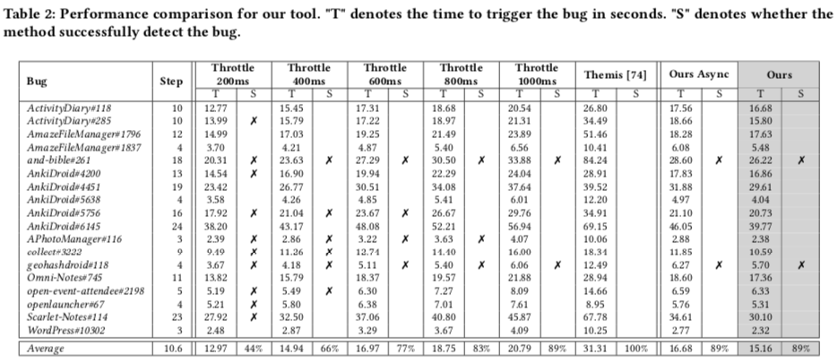

# Evaluation

The main quality of our study is the extent to whether our Throttledroid can effectively and efficiently accelerate the automated testing process.
To achieve our study goals, we formulate the following three research questions:

- **RQ1:** How accurate is our model in classifying GUI rendering state?
- **RQ2:** How effective and efficient is our approach in finding bugs?
- **RQ3:** How useful is our approach when integrated in real-world automated testing tools?

## RQ1: Performance of Model

 

1. We set up 11 baseline methods, including machine learning-based and deep learning-based, that are widely used in image classification tasks as the baselines to compare with our model. 
    - To reproduce the experiments, please follow the instructions in [`model_performance`](./model_performance).

> Our model achieves 99.8% accuracy which is much higher than that of baselines, e.g., 31.8% boost compared with the best machine learning baseline (SIFT-SVM). In addition, our model takes on average 43.02ms per GUI inference, representing the ability of our model to accurately and efficiently discriminate the GUI rendering state.

## RQ2: Performance of Throttledroid

 

1. We set up 6 throttling methods and 1 ablation study as our baselines to compare with our Throttledroid.
    - To reproduce the experiments, please follow the instructions in [`throttledroid_performance`](./throttledroid_performance).

> Our approach can detect most of the bugs (89%) in less time (15.16 seconds), e.g., 23% more bugs at similar run-time as 400ms setting, while 27% more efficient than 1000ms setting with the same bug detection rate. In addition, leveraging a real-time GUI rendering monitor speeds up the testing process than that of an asynchronous monitor (Ours Async), saving 1.52 seconds for 10.6 steps on average.
As a result, much of the time budget will be saved in hundreds or thousands of steps for long-term testing.

## RQ3: Usefulness of Throttledroid

 

1. To demonstrate how our Throttledroid can affect real-world testing environments, we integrated our approach into the mature automated testing tool Droidbot, namely Droidbot+Ours. In detail, Droidbot+Ours is adaptive to GUI rendering, moving to the next event as soon as GUI rendering is complete.
    - To reproduce the experiments, please follow the instructions in [`usefulness`](./usefulness).

> Droidbot+Ours achieves a median activity coverage of 43.14% across 32 Android apps, which is 6.95% higher even compared with the best baseline (e.g., 36.19% in Throttle 200ms). In addition, Droidbot+Ours explores 3,207 GUI states, and 88.81% are fully rendered, indicating the effectiveness and efficiency of our approach in covering most of the activities and fully rendered GUIs in real-world testing environments.