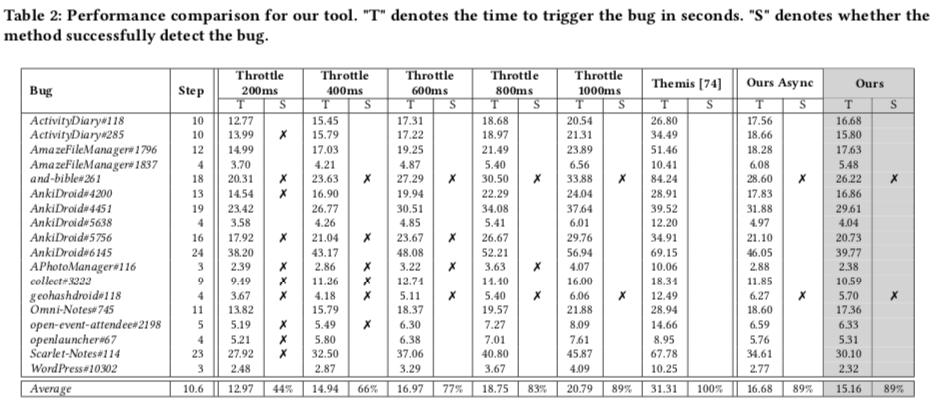

# Experiment for RQ2: Performance of Throttledroid
To answer RQ2, we evaluated the ability of our Throttledroid to efficiently detect the valid bug scenarios in app testing.

> The ultimate goal of automated testing is to find bugs. However, the randomness of the automated testing may affect the efficiency measurement, that is exploring different objects across different runs. To ensure the validity of evaluation, we set up a bug seed, which would generate the same sequence of events across different runs to trigger bugs.

## Testing dataset
We collected 18 testing seeds from 12 Android apps with defects studied in previous work **Themis**[^1].


## Experiment Setup
1. Clone the repoistory, **Themis** (https://github.com/the-themis-benchmarks/home). 
It contains apk file, crash info, replay script, and replay video.

2. Some scripts can not be replayed/verfied due to app content, network, device storage, multi-touch, etc. We revise 18 testing seeds in (*script_revised*).

3. Prepare the emulator or device. We are testing under *Nexus 5X, API 23 Marshmallow*.

4. Open `Developer Setting` > Enable `Don’t keep activities`

5. Ensure delete cache for apps(**Better factory the device**). For example:
* `AmazeFileManager`: Menu > Storage > Alarm > Delete **test** folder. Check script in [AmazeFileManager/script-#1796.py](themis/AmazeFileManager/script-#1796.py)
* `AnkiDroid`: Menu > Setting > Gesture > Disable gesture. Check script in [AnkiDroid/script-#4451.py](themis/AnkiDroid/script-#4451.py)

6. Ensure the emulator orientaion in portrait
```
adb shell content insert --uri content://settings/system --bind name:s:accelerometer_rotation --bind value:i:0
adb shell content insert --uri content://settings/system --bind name:s:user_rotation --bind value:i:0
```

7. Modify the input in [AnkiDroid-log-#5638.json](seed/AnkiDroid-log-#5638.json) for different operating system
```
For windows, "text": "\\&bsol\\;"
For mac and linux, "text": "&bsol;"
```


## Detecting bugs

### Throttledroid (Ours)
1. Detect the bugs under apps
```
SEED_DIR="./seed" 
THEMIS_DIR="./themis"
SERIAL="emulator-5556"
OUTPUT_DIR="./output_ours"
REPLAY_MODE="touch"         

python bug_detection.py --seed_dir ${SEED_DIR} \
                --themis_dir ${THEMIS_DIR} \
                --device_serial ${SERIAL} \
                --output_dir ${OUTPUT_DIR} \
                --replay_mode ${REPLAY_MODE} \
                --use_classifer \
                --use_minicap
```

### Throttledroid (Ours Async)
1. It leverages native ADB built-in function, for example, it first adopts *adb screencap* to capture the GUI screenshot to the device, and then *adb pull* to transmit to the local machine for GUI rendering state classification, asynchronously.

2. Disable `--use_minicap` for asynchronous ablation study.

### Throttling
1. Detect the bugs under apps (for example, throttle 200ms)
```
SEED_DIR="./seed" 
THEMIS_DIR="./themis"
SERIAL="emulator-5556"
OUTPUT_DIR="./output_throttle_200"
THROTTLE="200"
REPLAY_MODE="touch"         

python bug_detection.py --seed_dir ${SEED_DIR} \
                --themis_dir ${THEMIS_DIR} \
                --device_serial ${SERIAL} \
                --output_dir ${OUTPUT_DIR} \
                --replay_mode ${REPLAY_MODE} \
                --throttle ${THROTTLE} \
```


### Themis (Benchmark)
1. Follow the instructions to prepare Themis (https://github.com/the-themis-benchmarks/home)

2. Detect the bugs under apps
```
# modify the dir of sceipt_revised in line 94 in bug_detection.py
# python_script = os.path.join('script_revised', app_name, f'script-#{tag}.py')
SEED_DIR="./seed" 
THEMIS_DIR="./themis"
SERIAL="emulator-5556"
OUTPUT_DIR="./output_themis"
REPLAY_MODE="themis"

python bug_detection.py --seed_dir ${SEED_DIR} \
                --themis_dir ${THEMIS_DIR} \
                --device_serial ${SERIAL} \
                --output_dir ${OUTPUT_DIR} \
                --replay_mode ${REPLAY_MODE} \
```


## Results
<p align="center">
 
</p>
Our approach can detect most of the bugs (89%) in less time (15.16 seconds), e.g., 23% more bugs at similar run-time as 400ms setting, while 27% more efficient than 1000ms setting with the same bug detection rate. In addition, leveraging a real-time GUI rendering monitor speeds up the testing process than that of an asynchronous monitor (Ours Async), saving 1.52 seconds for 10.6 steps on average.
As a result, much of the time budget will be saved in hundreds or thousands of steps for long-term testing.


[^1]: Su, T., Wang, J., & Su, Z. (2021, August). Benchmarking automated GUI testing for Android against real-world bugs. In Proceedings of the 29th ACM Joint Meeting on European Software Engineering Conference and Symposium on the Foundations of Software Engineering (pp. 119-130).